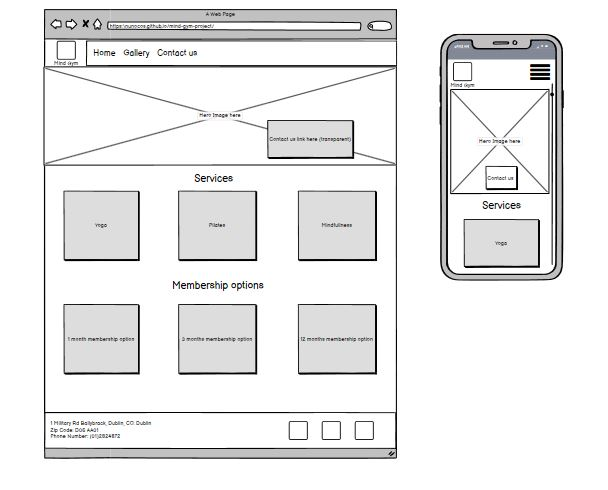
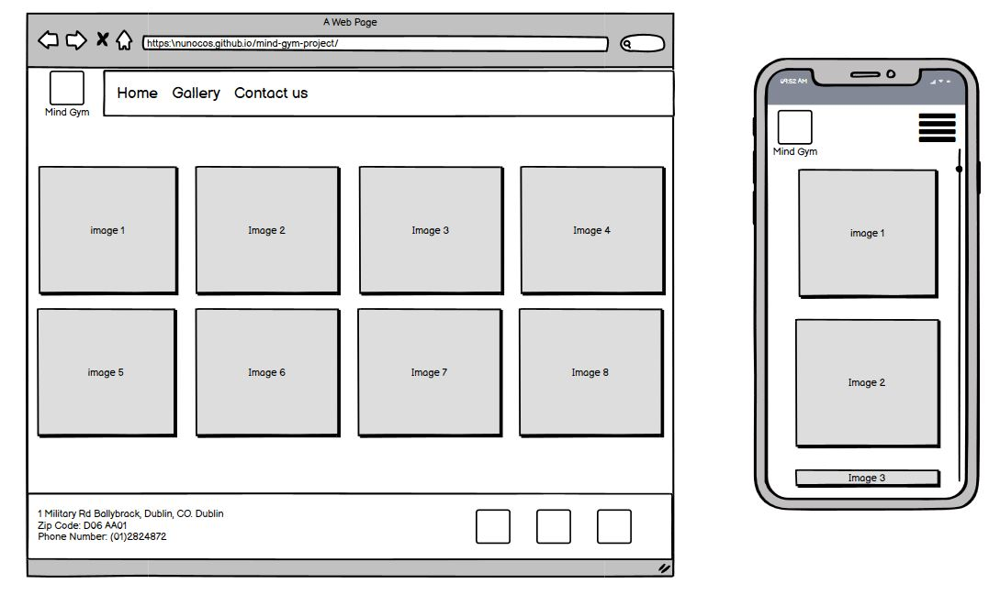
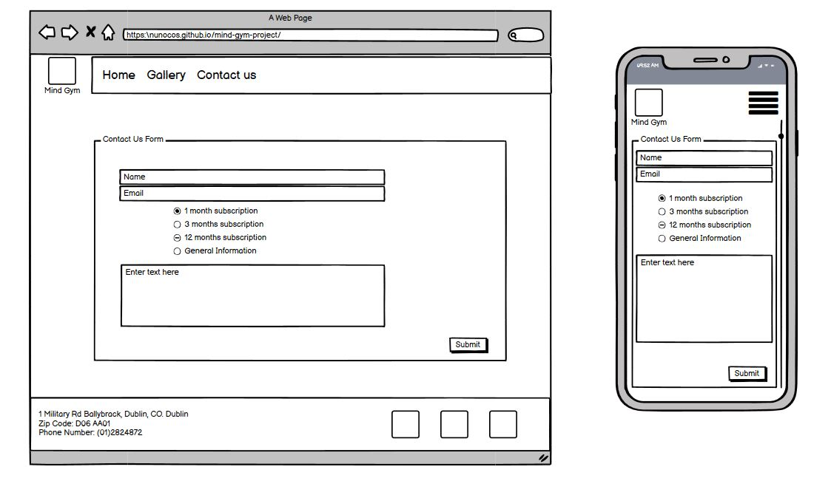

# [Mind Gym Project](https://nunocos.github.io/Mind-Gym-Project/)

Hello, welcome to my first very own project, the aim of my project is to deliver a different type of gym webpage. I will be using CSS and HTML.

---
## Description

The mind Gym, that is a ficticious gym, is a webpage where his target audience is a completely different audience from the normal gym, this is not focused on the physical condition but more on the mind side, which with the current pandemic we all need to have all support we can get.

---
## Testimonials

* "I want to have different types of classes"
* "I don't want to be having a yoga class in the same place as the pumping iron people go"
* "I would like to have a place where I can ease my mind"
* "I want to be able to attend a class without having to think what routine should I follow"
* "I think the website should reflect the type of activity as Yoga, Mindfulness and Pilates all induce calm"

---
## UX and Features

This website is designed to have an approach that induces calm, hence I opt for bright colors like whites and greys.

#### 1. Strategy
When I created this website I aimed to target an audience that likes exercizing the mind and body at the same time, there is a clean design to induce the type of
ambient that people will find at the gym.

##### Business Goals

* Increase visibility of the gym
* Increase number of customers
* Increase the reach of the gym

##### Customer Goals

* Have a safe space to relax
* have evidence that it is a reliable space
* Check space reviews
* Verify gym space by the Gallery
* Focusing on Mobile devices so that easily acessible

---
#### 2. Scope
The scope of the project was to include some influences from what the possible users described as a user friendly website and what they wish to observe on the type of content on this website.
The website is prepared as a mobile first approach that should be responsive in all devices and adapt to all browsers.

#### Current Features

* Navbar
    * Large sized font used to have a very good visibility of the content
    * Menu Icon for the Navbar when opened on mobile devices to respect convention when it comes to mobile websites
    * Contact Form easy to follow
    * Logo and Home buttons redirecting to main page to give more options to the user

* Homepage
    * Animation image to give visual impact to users and to pass on the message of the type of website
    * Services provided section to give the user the full list of Services
    * Membership sign up options
    * Link to social media accounts
    * Address and Google maps link to give more information to users

* Contact form
    * Easy to read contact form
    * Ability to select what membership option they wish to enquire or general query with free text.
    * Visible submit button
    * Background image selected to give same feeling and layout to the webpage

* Gallery section
    * Simple gallery section with images of the Classes and events being doesn
    * Responsive design to all devices
---
#### 3. Structure
The website was designed with simple layout so that it is easy to navigate and intuitive to all customers. There are essential pages on the navigation bar, which are: 

1. Home
2. Gallery
3. Contact Us

Followed the common guidelines to elaborating the website and feel these pages are suficient in the early stages of the project.

The navbar and footer are common to all pages to induce fluency on the webpage.

The footer has links to social media accounts, at the moment linking to my accounts, and ficticional address for the gym

---
#### 4. Skeleton

* Wireframe was created using [Balsamiq](https://balsamiq.com/)

##### Home Page

##### Gallery Page

##### Contact Us

---

#### 5. Surface

##### Design

* ###### Colour Scheme
    * Used [Coolors.co](https://coolors.co/) to generate a fluent colour pallet for the webpage.

* ###### Letter type
    * The letter type I chose was Exo and Roboto with Sans serif as a fall out if the letter type fails

* ###### Imagery
    * Images taken from unplash, as it is a ficticional space had to use generic images

* ###### Icons
    * Icons taken from fontawesome that provide context to the relevant section were they are being used

---

## Future Improvements

* Able to sign up to the gym via website and select type of membership
* Connect all forms so that they can reach the email inbox
* Create an Associate page so that the customer can manage their membership
* Create a video section with exercises for paying customers

---

## Changes

* Added Services section as it was not originally intended to be present, after making a more analytical analysis of the type of content the webpage should offer.
* Added background image to the Membership section to be more visually appealing.
* Added modal sign-up to all sections in the home page
---

## Technologies Used

##### Languages Used

* [HTML5](https://en.wikipedia.org/wiki/HTML5)
* [CSS3](https://en.wikipedia.org/wiki/CSS)

##### Frameworks, Libraries & Programs Used

* [Git](https://git-scm.com/)
* [Bootsrap] (https://getbootstrap.com/)
* [GitHub](https://github.com/)
* [Balsamiq](https://balsamiq.com/)
* [Google Fonts](https://fonts.google.com/)
* [Font Awesome](https://fontawesome.com/)
* [Coolors](https://coolors.co/ebf5df-bad4aa-d4d4aa-edb458-e8871e)
* [Chrome DevTools](https://developers.google.com/web/tools/chrome-devtools)
* [Autoprefixer CSS](https://autoprefixer.github.io/)

---

## Testing

##### Tests deployed

* Tested Form text fields, tried to submit without filling name, didn't allow to submit form
* Tested Form text fields, tried to submit without filling email, didn't allow to submit form
* Tested Form text fields, tried to submit without introducing proper email, didn't allow to submit form
* Tested Form radio buttons, tried to submit without introducing any option, didn't allow to submit form
* Tested Free text area on form, tried to submit without introducing any text, doesn't allow to submit form
* Tested Navigation bar, tested home button redirects to index.html page
* Tested contact us navbar button redirects to contact-us.html page
* Tested contact us button in callout section, redirects to contact-us.html page
* Tested clicking Logo, redirect to index.html page
* Tested Sign-up buttons on membership, all displaying the modal selected
* Tested modal in all devices, all adjusting to the device.

##### Validation

[W3C Markup Validator](https://validator.w3.org/)
* Index page - PASS
* Contact-us page - PASS
* Gallery page - PASS

[W3C CSS Validator](https://jigsaw.w3.org/css-validator/)
* PASS

##### Errors/Bugs During Device Testing

###### Devices Used
    * Android phone - Chrome browser
    * Macbook Pro 13" - Safari Browser
    * Ipad - Safari
    * Lenovo Windows Laptop - Chrome and Microsoft Edge

###### Bugs found
    * Membership section not displaying information horizontally
    * Text for radio buttons not aligned and mixing with text area
    * Found that on Device Iphone5/SE on Dev tools the menu bottom goes out of allignment considering not relevant
    * Found that on resolution lower than 320px a white bar appears on the right side, do not consider this as a issue as very low number of devices have this screen size.
    * Found that on Navbar if class Active displayed on the li the github pages wouldn't target the support pages
    * White bar on the top of index page on any screens, readjusted Keyframes to transform from 1 to 1.1 and not .9 to 1.
    *

###### [W3C Markup Validator](https://validator.w3.org/)
* "The document is not mappable to XML 1.0 due to two consecutive hyphens in a comment" - Solution: was using to many hyphens on the comments
* "Start tag body seen but an element of the same type was already open." - Solution: Empty space between head tag and body tag was causing this
---

## Deployment

##### GitHub Pages

1. A local project was created in GitHub with a new repository called 'Mind-Gym-Project'
2. The project had regular push and detailed commits which were pushed to the GitHub website before deployment
3. The project was deployed by logging in to GitHub and locating the [GitHub Repository](https://github.com/NunoCos/Mind-Gym-Project)
4. At the top of the Repository (not top of page), locate the "Settings" Button on the menu and click
5. Scroll down the Settings page until the "GitHub Pages" Section was found
6. Under "Source", click the dropdown called "None" and select "Master Branch"
7. The page will refresh and you will be brought back to the top of the settings page
8. Scroll back down through the page to locate the now published site [link](nunocos.github.io/mind-gym-project/) in the "GitHub Pages" section
9. The code can be run locally through clone or download, you can do this by opening the repository, clicking on the code button and then selecting either 'clone' or 'download'
10. The Clone option provides a url, which you can use on your desktop IDE
11. The Download option gives you a link so that you can download the zip file so that you can unzip it in your local machine
---

## Credits

##### Media
* Hero image sourced from [Unsplash](https://unsplash.com/photos/nKCtkaW4JU4)
* Membership image sourced from [Unsplash](https://unsplash.com/photos/dXrAfc9fDuI)
* Contact Form background image sourced rom [Unsplash](https://unsplash.com/photos/6KkYYqTEDwQ)
* Gallery images from Unsplash: 
    * [image2](https://unsplash.com/photos/YJdCZba0TYE)
    * [Image4](https://unsplash.com/photos/k1KCiRaDQhs)
    * [Image5](https://unsplash.com/photos/ZARfCYDaVg0)
    * [image7](https://unsplash.com/photos/YmqWafQKuRY)
    * [Image8](https://unsplash.com/photos/DFtjXYd5Pto)

##### Code Snippets

* ###### [Code Institute](https://codeinstitute.net/) 

  * Code for animation from the "Love Running" lessons and adapted to own project
  * Code for Hero image from "Whiskey Drop" lessons and adapted to own project
  * Code for Services section from "Whiskey drop" lessons and adpated to own project
  * Code for Footer section taken from "My resume" bootstrap mini project and "Love running" and adapted to own project
  * Code for Membership section from "Love Running" lessons and adapted to own project
  * Code for Contact Form from "Love Running" Lessons and adapted to own project

* ###### [Start Bootstrap](https://startbootstrap.com/snippets/thumbnail-gallery)
    * Code for Responsive gallery taken and adapted to own project.

* ###### [CSS Tricks](https://css-tricks.com/perfect-full-page-background-image/)

    * Code for Fullpage background, based from whiskey drop Code Institute lessons and adapted to own project

* ###### [Google Maps extention](https://www.embedgooglemap.net/)
    * Code for Google maps taken from this source but adapted to own project

* ###### [Stack Overflow](https://stackoverflow.com/questions/13509883/how-to-vertically-align-a-html-radio-button-to-its-label/13510184)
    * Code for resolution of align the text on radio buttons 

##### Other References

* ###### [Fake Address Generator](https://www.fakeaddressgenerator.com/All_countries/address/country/Ireland)
    * Fake Address Generator used to generate a ficticius address for the gym

* ###### [Mayo Clinc](https://www.mayoclinic.org/healthy-lifestyle/fitness/in-depth/pilates-for-beginners/art-20047673)
    *Description of Pilates class

* ###### [Yoga journal](https://www.yogajournal.com/meditation/yoga-questions-answered)
    * Description of Yoga

* ###### [Mental Health Foundation](https://www.mentalhealth.org.uk/a-to-z/m/mindfulness)
    * Description of Yoga        
---

## Acknowledgements

I would like to thank my mentor, **Spencer Barriball**, for his help on this project and for providing me some tools that made my project easier,
**Slack Community** for their assistance with minor coding issues and **Jim Lynx** for hosting the MS1 planning session that really helped me out.

---

## Support

For any issues or information, please email me on nuno18_9@hotmail.com

Thank you for the time reviewing my Readme file and hope you enjoy my project.
